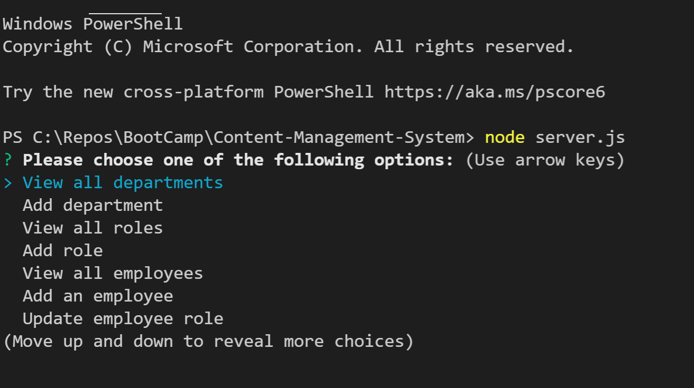

# Content-Management-System 

## Overview

Content Management System is a commandline application to manage a company's employee database. This application is built using Node.js, Inquirer and MySQL for data storage.

## User Story
```
AS A business owner
I WANT to be able to view and manage the departments, roles, and employees in my company
SO THAT I can organize and plan my business
```
## Acceptance Criteria
```
GIVEN a command-line application that accepts user input
WHEN I start the application
THEN I am presented with the following options: view all departments, view all roles, view all employees, add a department, add a role, add an employee, and update an employee role
WHEN I choose to view all departments
THEN I am presented with a formatted table showing department names and department ids
WHEN I choose to view all roles
THEN I am presented with the job title, role id, the department that role belongs to, and the salary for that role
WHEN I choose to view all employees
THEN I am presented with a formatted table showing employee data, including employee ids, first names, last names, job titles, departments, salaries, and managers that the employees report to
WHEN I choose to add a department
THEN I am prompted to enter the name of the department and that department is added to the database
WHEN I choose to add a role
THEN I am prompted to enter the name, salary, and department for the role and that role is added to the database
WHEN I choose to add an employee
THEN I am prompted to enter the employee’s first name, last name, role, and manager, and that employee is added to the database
WHEN I choose to update an employee role
THEN I am prompted to select an employee to update and their new role and this information is updated in the database 

```

## Table of Contents

- [Overview](#overview)
- [User Story](#user-story)
- [Acceptance Criteria](#acceptance-criteria)
- [Installation](#installation)
- [Usage](#usage)
- [Screenshots](#screenshots)
- [Questions](#questions)
- [License](#license)
- [Walkthrough video](#walkthrough-video)

    ## Installation
   - Fork repository.
   - Should have access to Visual Studio, Node.js and MySql
   - Run npm install to install packages/dependencies (inquirer, mysql2).
   
    ## Usage
    Launch the command line terminal from the root directory by running the command node server.js. You will be presented with options as stated in the acceptance criteria. Choose the options and provide appropriate details for the application to update the database with information about employees. Responses are presented in the form of tables for the user to view. Choose Exit to quit the application. 
   
    ## Screenshots
    

    ## Questions
    For any questions regarding the project please visit my 
    GitHub Profile @ 
    [chaitra-srinivas](https://github.com/dfdfgfd)
    or you can reach me @ cmurthy.dev@gmail.com
    
    ## License
    [MIT](https://opensource.org/licenses/MIT)
    This application is convered under the MIT License.
    

    ## [Walkthrough video](https://heroku-notes-taker.herokuapp.com/)


    Copyright © 2021 Chaitra Srinivasamurthy 
    